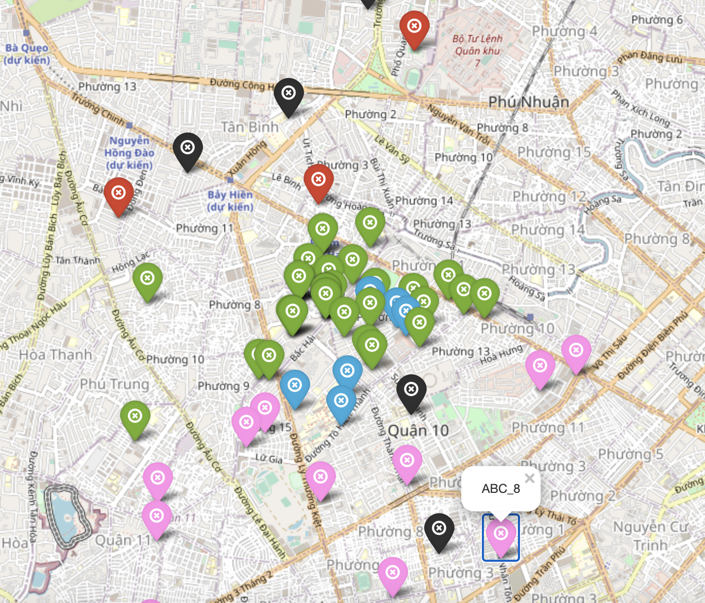

# hackathon_VRP
My very first Hackathon competition in my current companny for Technical team.

My team project is to solve VRP (Vehical Routing Problem)

This part of code is just my part for Auto Assign algorithm using KMeans Clustering and using priority (based on distance to warehouse, weight, deadline pick/deliver of each order) to arrange orders in routing.

I mainly used Python for this algorithm
Although not got high prize, but the algorithm and result made me sastisfied with my first Hackathon experience.

